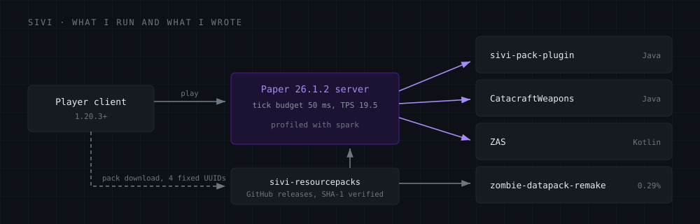

First-year Computer Science student at **PTIT**, Ho Chi Minh City campus. Most of what I know
came from running a Minecraft server in production and being forced to fix it — real players,
real crashes, real 600 ms stalls to hunt down. I write the plugins, host the resource packs,
and do the profiling myself.

Heading toward **DevSecOps**. The first-year plan is to get genuinely good at building things
before trying to break them.

## Things I actually debugged

| Symptom | Root cause | Result |
| :--- | :--- | :--- |
| Recurring **620 ms** tick spike, every 40 ticks | A structure queue calling `isChunkGenerated` 300–500× per cycle — blocking region-file I/O on the main thread | TPS **17.3 → 19.5**, spike gone |
| Server crawling under gunfire | Shell casings living **5 minutes** because the `Age` NBT field counts *up*, not down | 23 casings → 0 in 37 s |
| Weapons duplicating on fast scroll | 1-tick race: the handler read the held slot *after* the scheduled task ran, instead of capturing it from the event | Fixed across 3 layers |
| Zombies vanishing from custom structures | Spawn overrides silently emptied, plus a mob-replace chain that required non-air blocks exactly where the mob's own head had to be | Verified in-game |
| Blaming the wrong thing | Profiled it: 115 zombies at midnight, TPS still **20.0**. The datapack cost **0.29%** | Hypothesis killed by data |

Most of these came out of an offline `.sparkprofile` parser I wrote — the protobuf tree is flat
with index references, so self-time is total minus the sum of its children.

## Selected work

**[sivi-pack-plugin](https://github.com/ObsidianMC123/sivi-pack-plugin)** — `Java` `Paper API`
Minecraft 1.20.3+ clients keep a *stack* of resource packs, but calling `sendResourcePacks()`
four times wipes that stack on each call and only the last pack survives. This sends all four at
once, with fixed UUIDs so the client reuses its cache instead of re-downloading 24 MB on every
join, and holds the player invulnerable until every pack lands.

**[sivi-resourcepacks](https://github.com/ObsidianMC123/sivi-resourcepacks)** — `Paper 26.1.2`
Pack host for the server. Tagged releases served straight off `raw.githubusercontent`,
SHA-1 verified byte for byte with an anonymous client before anything ships.

**[AI-Classroom](https://github.com/ObsidianMC123/AI-Classroom)** — `ESP32` `Arduino` `Node.js`
Smart classroom: environmental monitoring and real-time control over WebSocket, with on-device
AI. Hardware, firmware and the server side.

**[javaplugin](https://github.com/ObsidianMC123/javaplugin)** — `Java`
The plugins I wrote while learning the language. Public on purpose — it is the honest starting line.

<b>Private work — happy to walk through any of it</b>

 

| Project | What it is | Stack |
| :--- | :--- | :--- |
| **CatacraftWeapons** | 21 guns, 2126 animation frames, recoil / ammo / hitmarkers. Headshots use damage *ratios* rather than hardcoded numbers, so baby zombies still register | `Java` `Paper API` |
| **ZAS** | Zombie-apocalypse spawning and jigsaw structure generation, ported to Paper 26.1.2 | `Kotlin` `Gradle` |
| **zombie-datapack-remake** | Datapack overhaul: biome spawn overrides, jigsaw checkpoints, structure QA tooling | `mcfunction` `JSON` `Node.js` |
| **MCP tool server** | 64-tool Model Context Protocol server — filesystem, shell, terminal, HTTP and deep browser automation (network interception, console capture, storage, E2E flows) over streamable HTTP | `Node.js` `MCP SDK` |

## Stack

| | |
| :--- | :--- |
| **Daily** | Java, Kotlin — Paper API plugins, Gradle |
| **Tooling** | Node.js, PowerShell, Git |
| **Also used** | Python, JavaScript, ESP32 / Arduino, Cloudflare Tunnel, Model Context Protocol |

The repos on this profile are a mix of things I built, things I forked to read, and things
from before I knew better. <b>The pinned ones are the ones I would actually show you.</b>
